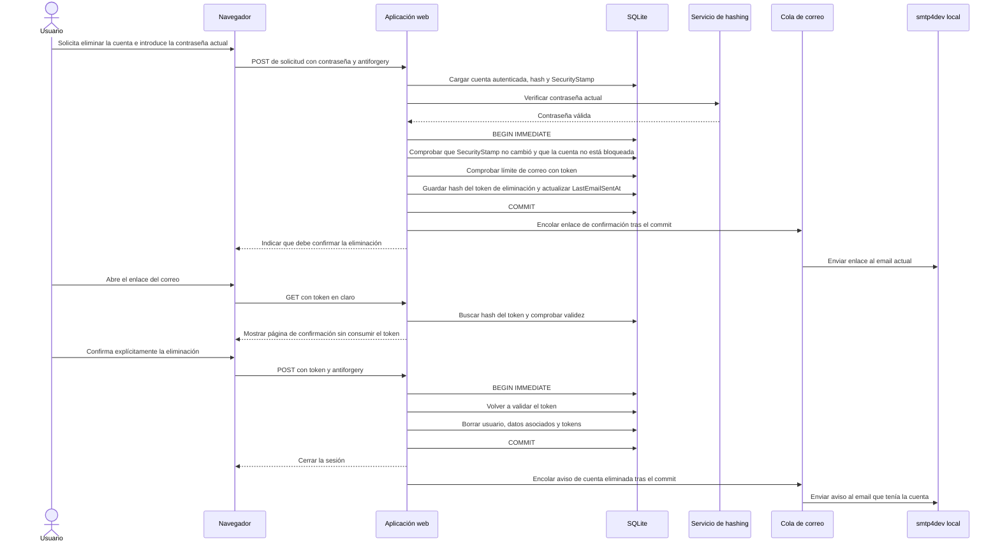

# Secuencia de eliminación de cuenta

Flujo de eliminación de cuenta, definido en [specifications.md → «Eliminación de cuenta»](../specifications.md#eliminación-de-cuenta).

Si la contraseña no es válida, no se emite el token. Si `SecurityStamp` cambió desde que se verificó la contraseña o la cuenta quedó bloqueada mientras se calculaba el hash, se revierte la transacción y no se emite token ni se cuentan intentos contra el estado nuevo de la cuenta (ver [specifications.md → «Verificación concurrente de contraseña»](../specifications.md#verificación-concurrente-de-contraseña)). Si se alcanza el límite de correo, no se emite uno nuevo ni se envía el mensaje; los tokens anteriores conservan su vigencia según [specifications.md → «Correo»](../specifications.md#correo) y [«Tokens»](../specifications.md#tokens). El GET no elimina la cuenta ni consume el token; la operación destructiva solo ocurre en el POST explícito.
