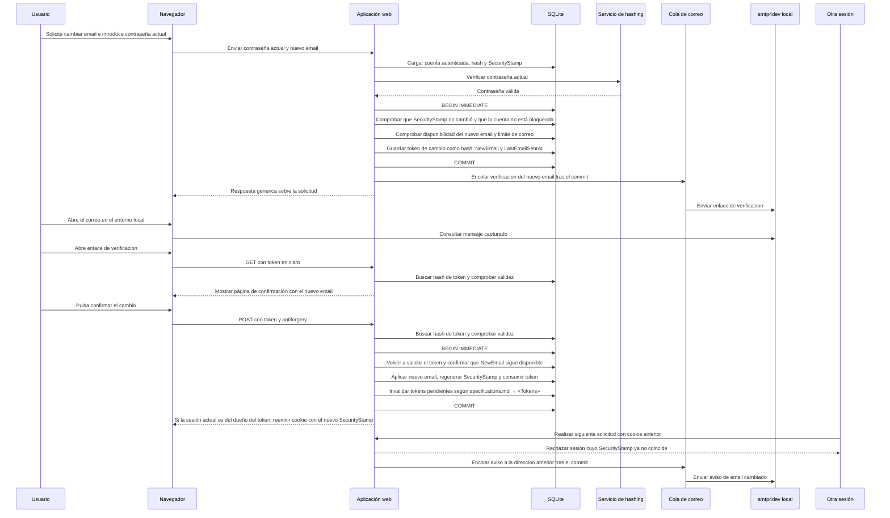

# Secuencia de cambio de email

Flujo válido del cambio de email, definido en [specifications.md → «Cambio de email»](../specifications.md#cambio-de-email). Las ramas de rechazo se enumeran después del diagrama.

Ramas de rechazo omitidas en el diagrama:

- Si el nuevo email es el mismo que el actual, no se emite token y se informa al usuario.
- Si el nuevo email ya pertenece a otra cuenta, no se emite token y se envía a esa dirección el aviso de cuenta existente; la respuesta al usuario sigue siendo genérica.
- Si la contraseña actual es incorrecta o la cuenta está bloqueada, se rechaza la solicitud según [specifications.md → «Bloqueo por intentos fallidos»](../specifications.md#bloqueo-por-intentos-fallidos); no se continúa con el cambio.
- Si `SecurityStamp` cambió desde que se verificó la contraseña, o la cuenta quedó bloqueada mientras se calculaba el hash, se revierte la transacción y no se emite token ni se cuentan intentos contra el estado nuevo de la cuenta (ver [specifications.md → «Verificación concurrente de contraseña»](../specifications.md#verificación-concurrente-de-contraseña)).
- Si se alcanza el límite de correo, no se emite un token nuevo ni se envía el correo; se aplica [specifications.md → «Correo»](../specifications.md#correo).
- Si el token no es válido al abrir el enlace o al confirmar, se muestra la respuesta común de [specifications.md → «Tokens»](../specifications.md#tokens).
- Si otra cuenta ocupa el nuevo email antes de la confirmación, se muestra esa misma respuesta común.
