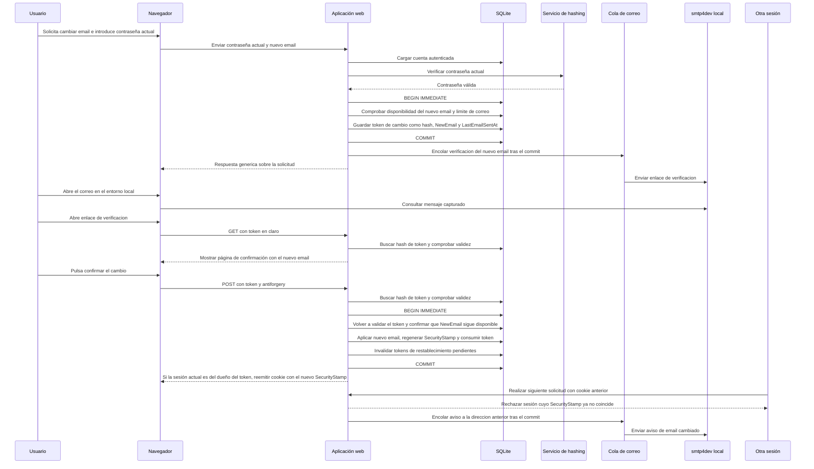

# Secuencia de cambio de email

Flujo previsto para el MVP1, definido en [specifications.md → «Cambio de email»](../specifications.md#cambio-de-email). Las ramas de rechazo se resumen después del diagrama para mantener la sintaxis de secuencia compatible con el renderizador.

La contraseña actual debe verificarse antes de solicitar el cambio. Si el nuevo email está ocupado, no se emite token y se envía un aviso a esa dirección; la respuesta al usuario sigue siendo genérica. Si se supera el límite de correo, no se emite token ni se envía el correo. Si otra cuenta ocupa el nuevo email antes de la confirmación, esta falla con la misma respuesta que un token inválido o caducado. El token en claro solo viaja en el enlace; se almacena su hash. Abrir el enlace solo muestra la página de confirmación; el cambio se aplica con el POST. La sesión desde la que se confirma sigue abierta con la cookie renovada solo si pertenece al dueño del token; las demás dejan de ser válidas por el cambio de `SecurityStamp`.