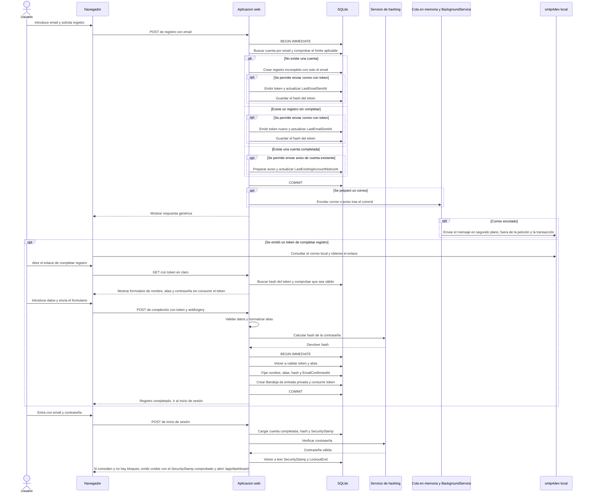

# Secuencia de registro y primer uso

Flujo derivado de las reglas de cuenta y persistencia descritas en [specifications.md](../specifications.md), [domain-model.md](../domain-model.md) y [architecture.md](../architecture.md).

