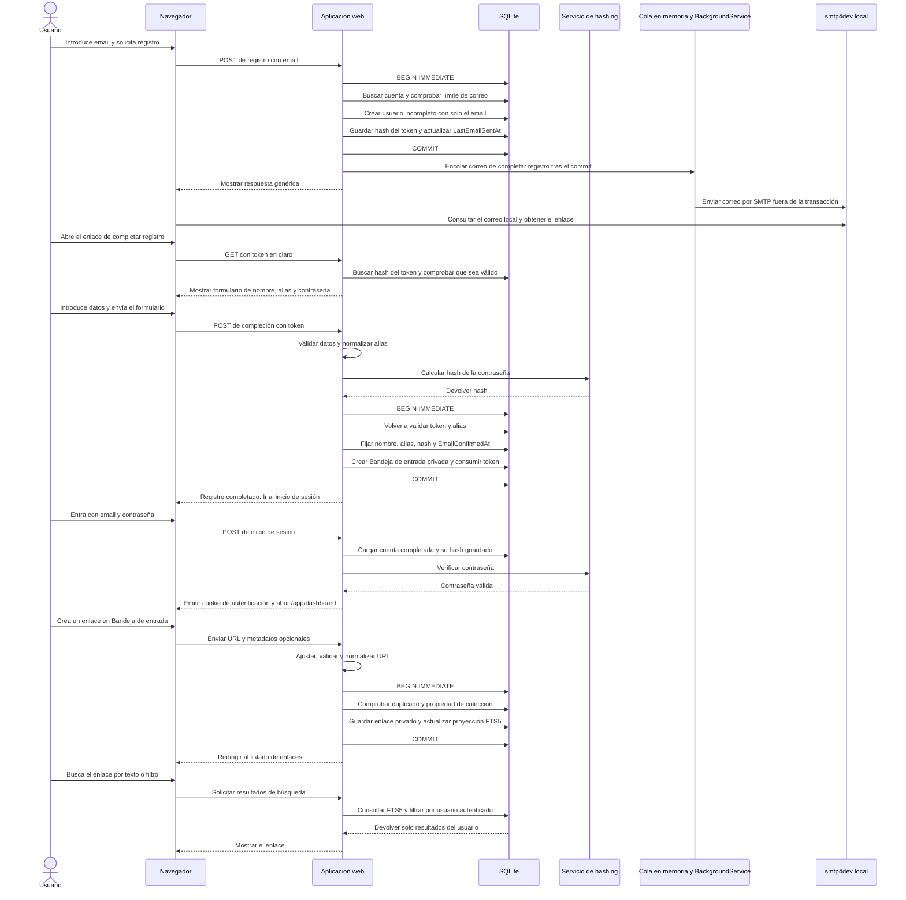

# Secuencia de registro y primer uso

Flujo previsto para el MVP1, derivado de las reglas de cuenta y persistencia descritas en [specifications.md](../specifications.md), [domain-model.md](../domain-model.md) y [architecture.md](../architecture.md). En el MVP0, la gestión privada usa la identidad de desarrollo inyectada y no ejecuta este registro ni este login.

La secuencia muestra el recorrido de una cuenta nueva con email disponible y datos válidos. Si el email ya tiene un registro incompleto, se renueva el token; si la cuenta está completada, se envía un aviso sin token. La respuesta al registro es genérica en todos los casos. Si se supera el límite de correo no se emite otro token ni se envía correo, y cualquier token previo sin usar sigue vigente. Si el token no es válido o los datos no superan la validación, no se completa la cuenta; los errores del formulario no consumen el token.

El token en claro solo viaja en el enlace del correo; SQLite conserva su hash. El usuario informa manualmente los metadatos del enlace. La obtención automática de metadatos se incorpora en MVP1. La cuenta solo queda confirmada al completar correctamente el registro; el inicio de sesión se realiza después con normalidad.