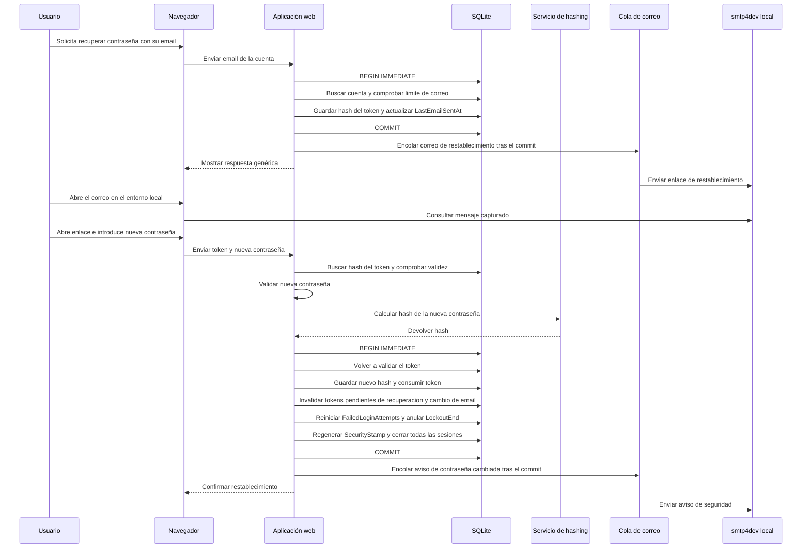

# Secuencia de recuperación y restablecimiento de contraseña

Diagrama del camino válido de una cuenta completada, definido en [specifications.md → «Recuperación de contraseña»](../specifications.md#recuperación-de-contraseña).

La solicitud siempre recibe la misma respuesta, exista o no una cuenta. Para una cuenta completada se envía el enlace de restablecimiento; para un registro sin completar se envía el correo de completar registro; si no existe cuenta, no se envía correo. Si se supera el límite de correo, no se emite token ni se envía mensaje. Un token inválido, usado o caducado no permite completar el cambio. El token en claro solo viaja en el enlace; se almacena su hash. El restablecimiento cierra todas las sesiones.