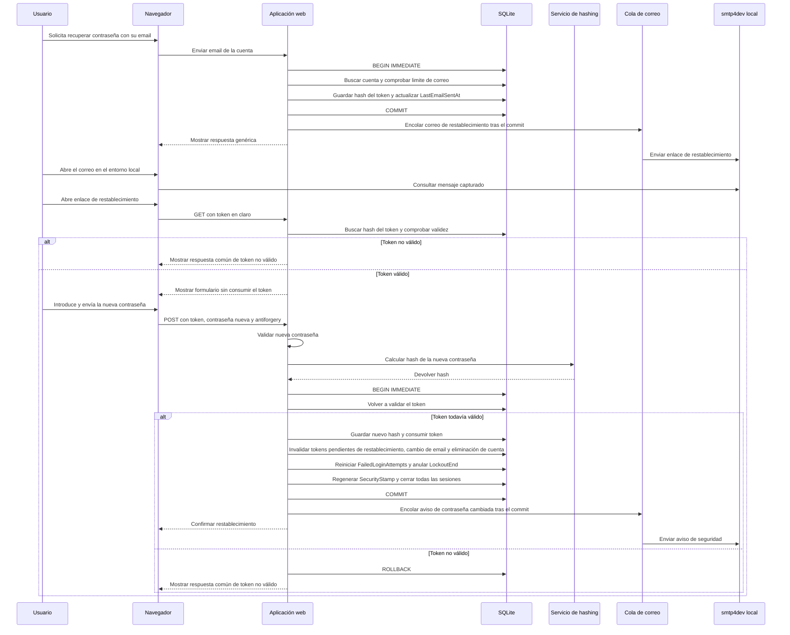

# Secuencia de recuperación y restablecimiento de contraseña

Flujo del camino válido de una cuenta completada, definido en [specifications.md → «Recuperación de contraseña»](../specifications.md#recuperación-de-contraseña).

