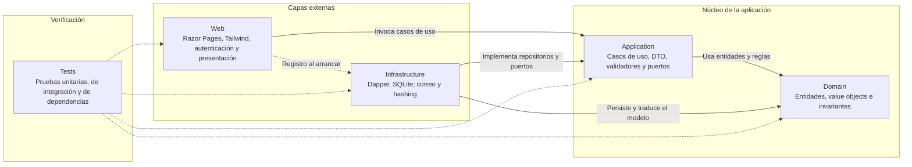

# Capas y dependencias

Vista derivada de [architecture.md → «Dependencias entre proyectos»](../architecture.md#dependencias-entre-proyectos). Los cuatro proyectos de producción forman el grafo productivo; las flechas continuas muestran sus referencias ordinarias y las discontinuas, una referencia restringida de composición o de verificación.

