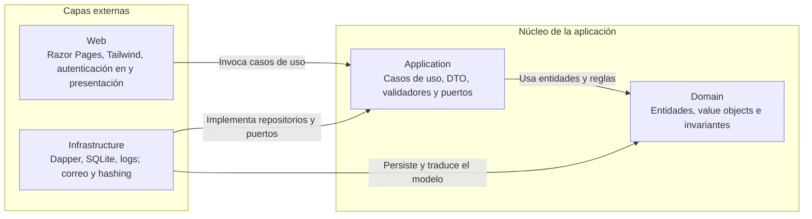

# Capas y dependencias

Vista derivada de [architecture.md → «Capas»](../architecture.md#capas). Las flechas indican dependencias de código: las capas externas pueden depender del núcleo, pero el dominio no depende de infraestructura ni de la interfaz web.

