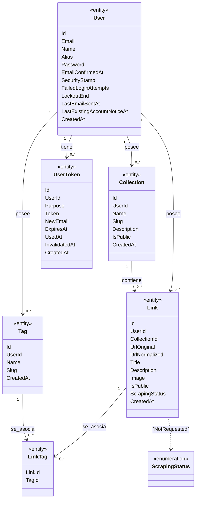

# Diagrama de clases

Vista derivada del modelo de dominio. Las propiedades e invariantes tienen como fuente de verdad [domain-model.md](../domain-model.md). Solo se muestran atributos documentados: no se especifican aquí tipos de implementación ni métodos de clase.

La multiplicidad User–Collection contempla todos los estados de la cuenta; la condición para las cuentas completadas está en [domain-model.md → «User»](../domain-model.md#user).

