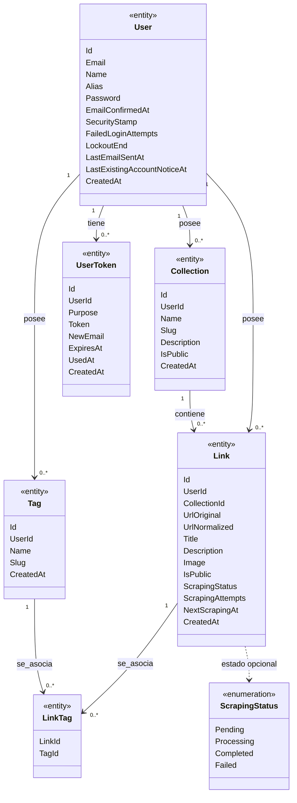

# Diagrama de clases

Vista derivada del modelo de dominio. Las propiedades e invariantes tienen como fuente de verdad [domain-model.md](../domain-model.md). Solo se muestran atributos documentados: no se especifican aquí tipos de implementación ni métodos de clase.

`Tag` y `LinkTag` se muestran como entidades previstas para el MVP1; no forman parte del MVP0.

Un usuario con el registro incompleto puede no tener colecciones; una vez completado el registro, tiene al menos una. Cada `LinkTag` asocia exactamente un enlace con una etiqueta, y la pareja `LinkId + TagId` es única. Las reglas de propiedad entre usuarios y de público y privado se detallan en [domain-model.md](../domain-model.md).

Los valores de `ScrapingStatus` son los definidos en [specifications.md → «Estados del scraping»](../specifications.md#estados-del-scraping). `Purpose` se mantiene como atributo porque la documentación describe sus usos, pero no define nombres técnicos para una enumeración.
