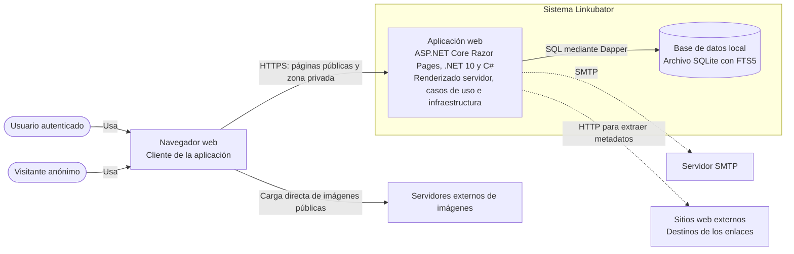

# Diagrama de contenedores

Vista general de los contenedores prevista en [architecture.md](../architecture.md), derivada también de [requirements.md](../requirements.md). No representa una etapa de entrega concreta. Los contenedores describen unidades de ejecución; las capas internas de Clean Architecture no se dibujan como contenedores independientes.

