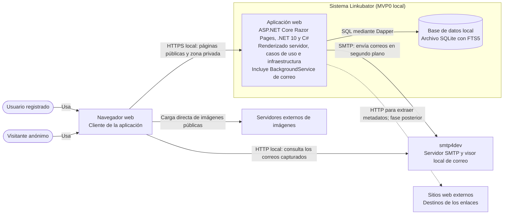

# Diagrama de contenedores

Vista derivada de la arquitectura prevista. Los contenedores describen unidades de ejecución; las capas internas de Clean Architecture no se dibujan como contenedores independientes.

## Notas

- La aplicación web, el almacenamiento SQLite y la integración SMTP son elementos previstos; este diagrama no afirma que estén implementados.
- El `BackgroundService` de correo se aloja en el proceso de la aplicación web. La cola de correo es en memoria, no un contenedor ni un servicio de colas separado.
- FTS5 forma parte del almacenamiento SQLite. Las capas Domain, Application, Infrastructure y Web son divisiones internas del código, no contenedores ejecutables separados.
- `smtp4dev` captura los mensajes en local y los presenta en su interfaz web; no entrega correo real.
- El scraper HTTP se implementará en una fase posterior. Su diseño sigue teniendo decisiones pendientes, por lo que la relación discontinua indica una integración futura.
- El navegador descarga directamente las imágenes de sus servidores de origen; Linkubator no las sirve mediante un proxy.