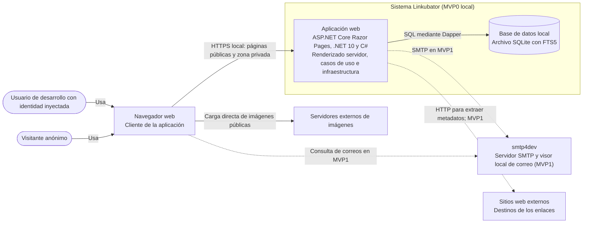

# Diagrama de contenedores

Vista derivada de la arquitectura prevista. Los contenedores describen unidades de ejecución; las capas internas de Clean Architecture no se dibujan como contenedores independientes.

## Notas

- La aplicación web y el almacenamiento SQLite son elementos previstos; este diagrama no afirma que estén implementados. La identidad de desarrollo del MVP0 se inyecta desde código.
- La integración SMTP y el `BackgroundService` de correo se incorporan en el MVP1. La cola de correo será en memoria, no un contenedor ni un servicio de colas separado.
- FTS5 forma parte del almacenamiento SQLite. Las capas Domain, Application, Infrastructure y Web son divisiones internas del código, no contenedores ejecutables separados.
- En el MVP1, `smtp4dev` capturará los mensajes en local y los presentará en su interfaz web; no entregará correo real.
- El scraper HTTP se implementará en MVP1. Su diseño sigue teniendo decisiones pendientes, por lo que la relación discontinua indica una integración futura.
- El navegador descarga directamente las imágenes de sus servidores de origen; Linkubator no las sirve mediante un proxy.