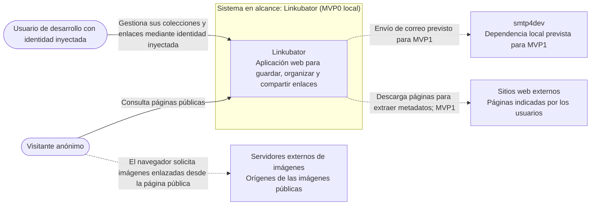

# Diagrama de contexto

Vista derivada de los requisitos y de la arquitectura. El diagrama representa el MVP0 ejecutado en local; la aplicación es el sistema en alcance.

## Alcance y límites

- En el MVP0, el usuario de desarrollo actúa con una identidad válida inyectada desde código; no hay registro ni autenticación real. La persona también puede actuar como visitante.
- La gestión de etiquetas y sus asociaciones con enlaces se incorpora en el MVP1.
- `smtp4dev` y los flujos de cuenta que lo requieren se incorporan en el MVP1; la relación discontinua no implica que se envíe correo en el MVP0.
- El scraping HTTP está confirmado para MVP1 y todavía tiene decisiones pendientes. La relación discontinua no implica que esté implementado en MVP0.
- En las páginas públicas, el navegador solicita directamente las imágenes a sus servidores de origen. Linkubator no actúa como proxy de imágenes.
- SQLite y FTS5 son componentes internos de la solución, no sistemas externos del diagrama de contexto.