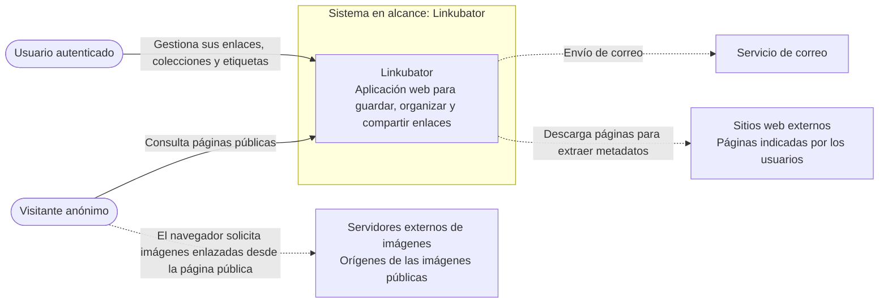

# Diagrama de contexto

Vista general del producto, derivada de [requirements.md](../requirements.md) y [architecture.md](../architecture.md). No representa una etapa de entrega concreta.

```mermaid
flowchart LR
    visitor([Visitante anónimo])
    user([Usuario autenticado])

    subgraph boundary["Sistema en alcance: Linkubator"]
        app["Linkubator<br/>Aplicación web para guardar, organizar y compartir enlaces"]
    end

    mail["Servicio de correo"]
    targetSites["Sitios web externos<br/>Páginas indicadas por los usuarios"]
    imageHosts["Servidores externos de imágenes<br/>Orígenes de las imágenes públicas"]

    visitor -->|Consulta páginas públicas| app
    user -->|Gestiona sus enlaces, colecciones y etiquetas| app
    app -.->|Envío de correo| mail
    app -.->|Descarga páginas para extraer metadatos| targetSites
    visitor -.->|El navegador solicita imágenes enlazadas desde la página pública| imageHosts
```
