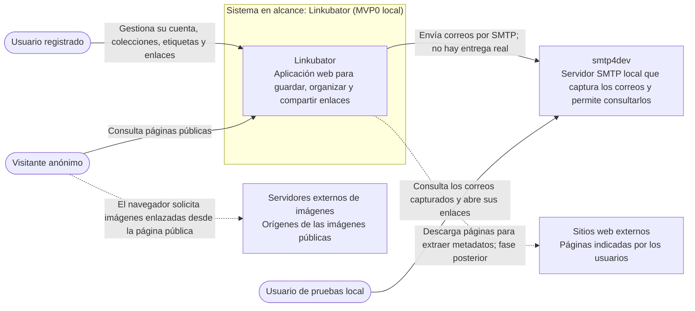

# Diagrama de contexto

Vista derivada de los requisitos y de la arquitectura. El diagrama representa el MVP0 ejecutado en local; la aplicación es el sistema en alcance.

## Alcance y límites

- El usuario registrado y el visitante representan roles de interacción con Linkubator; una misma persona puede actuar en ambos roles.
- `smtp4dev` es una dependencia local de desarrollo. Linkubator envía allí los correos; la persona que prueba la aplicación los consulta en la interfaz de smtp4dev.
- El scraping HTTP está previsto para una fase posterior del MVP0 y todavía tiene decisiones pendientes. La relación discontinua no implica que esté implementado.
- En las páginas públicas, el navegador solicita directamente las imágenes a sus servidores de origen. Linkubator no actúa como proxy de imágenes.
- SQLite y FTS5 son componentes internos de la solución, no sistemas externos del diagrama de contexto.