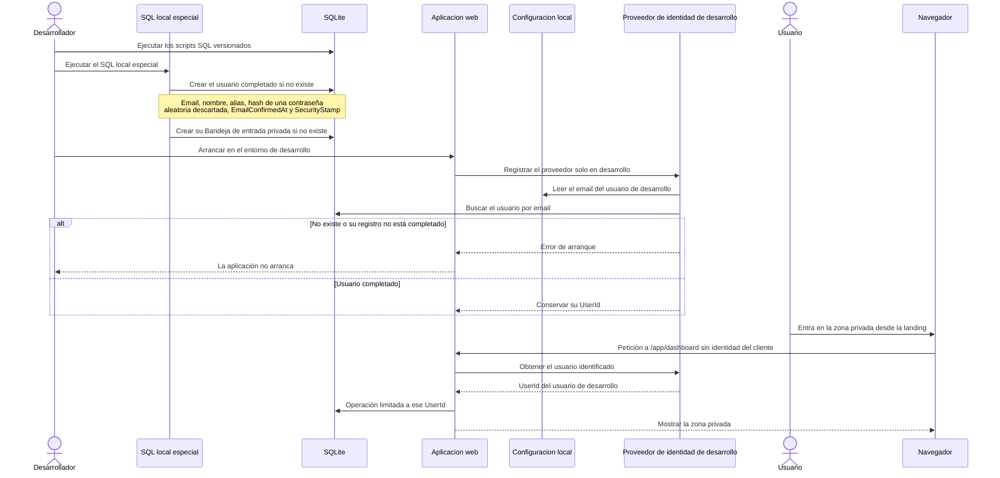

# Secuencia de la identidad de desarrollo

Flujo del MVP0, derivado de [architecture.md → «Identidad de desarrollo»](../architecture.md#identidad-de-desarrollo). En el MVP1 este proveedor se sustituye por la sesión autenticada.

