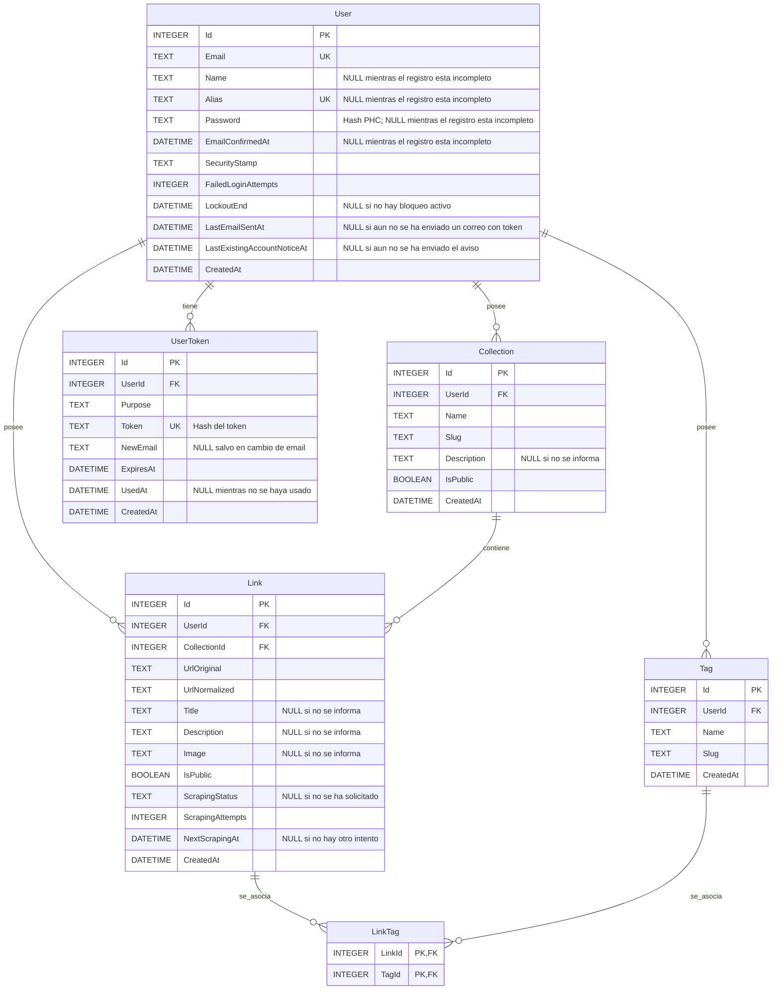

# Diagrama ER

Vista derivada del modelo de dominio y de la arquitectura. Las propiedades e invariantes tienen como fuente de verdad [domain-model.md](../domain-model.md); la persistencia y los índices, [architecture.md](../architecture.md).

## Restricciones e índices

Un usuario con el registro incompleto todavía no tiene colecciones; una vez completado, tiene al menos una. Cada enlace pertenece a un usuario y a una colección. La propiedad compartida entre ambos se garantiza además con la clave foránea compuesta `Link (UserId, CollectionId)` → `Collection (UserId, Id)`. Cada etiqueta y cada token pertenecen a un usuario. La relación entre enlaces y etiquetas usa la clave compuesta `LinkTag (LinkId, TagId)`.

Índices y restricciones únicos definidos:

- `User (Email)` y `User (Alias)`.
- `Collection (UserId, Slug)`.
- `Collection (UserId, Id)`, índice único requerido por la clave foránea compuesta desde `Link`.
- `Link (UserId, UrlNormalized)`.
- `Tag (UserId, Slug)`.
- `LinkTag (LinkId, TagId)`, clave primaria compuesta.
- `UserToken (Token)`.

También están previstos índices por usuario, colección, estado público y fecha, y un índice de `UserToken` por usuario y propósito. La documentación aún no especifica las columnas concretas ni el orden de esos índices no únicos. FTS5 es una proyección de búsqueda aparte, no una relación ER normalizada.

Los identificadores son `INTEGER PRIMARY KEY`, salvo la clave compuesta de `LinkTag`. Los demás tipos del diagrama son descriptivos: la documentación no fija aún su declaración SQLite exacta.