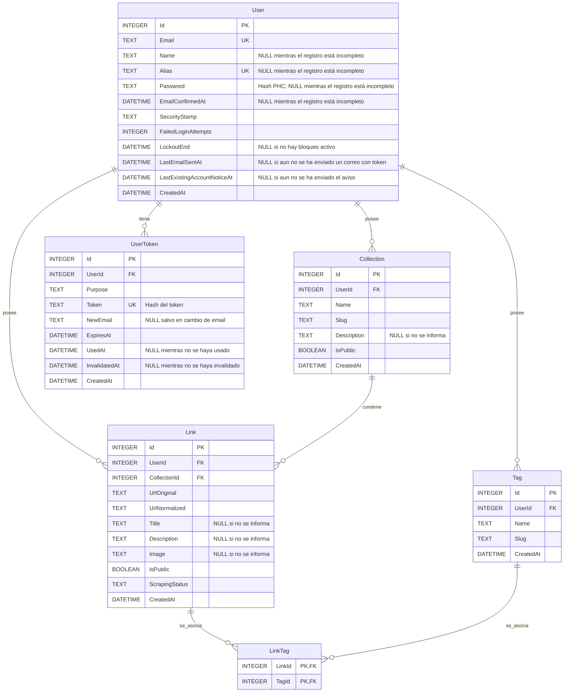

# Diagrama ER

Vista derivada del modelo de dominio y de la arquitectura. Las propiedades e invariantes tienen como fuente de verdad [domain-model.md](../domain-model.md); la persistencia y los índices, [architecture.md → «Persistencia»](../architecture.md#persistencia).

La multiplicidad User–Collection contempla todos los estados de la cuenta; la condición para las cuentas completadas está en [domain-model.md → «User»](../domain-model.md#user).

