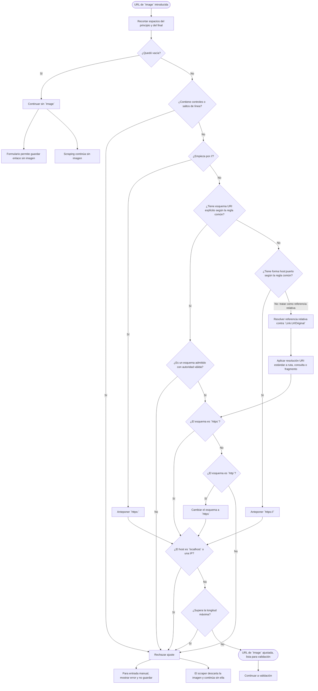

# Proceso de ajuste de URL para Image

Diagrama derivado de [specifications.md → «Ajuste de `Image`»](../specifications.md#ajuste-de-image). Muestra el ajuste; la validación posterior se detalla en [specifications.md → «Validación»](../specifications.md#validación).

