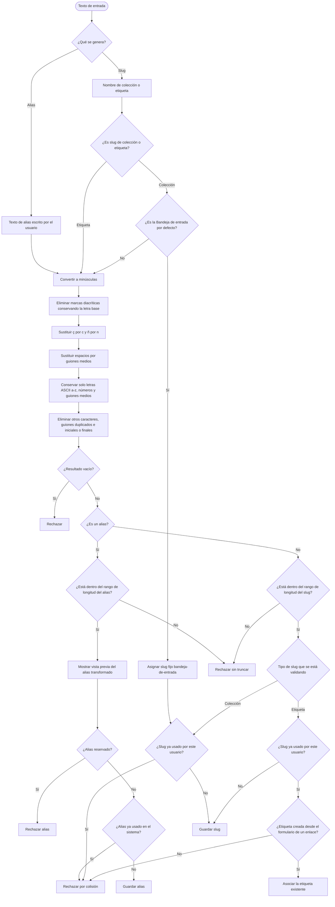

# Proceso de generación de alias y slugs

Diagrama derivado de [specifications.md → «Generación de alias y slugs»](../specifications.md#generación-de-alias-y-slugs).

El alias se transforma antes de mostrar la vista previa y se valida antes de guardarlo. Los slugs se generan a partir del nombre y no se muestran al usuario. La coincidencia de nombre dentro de un usuario se resuelve mediante la unicidad del slug generado. La lista de valores reservados, los rangos y las reglas de colisión tienen como fuente de verdad [specifications.md](../specifications.md).