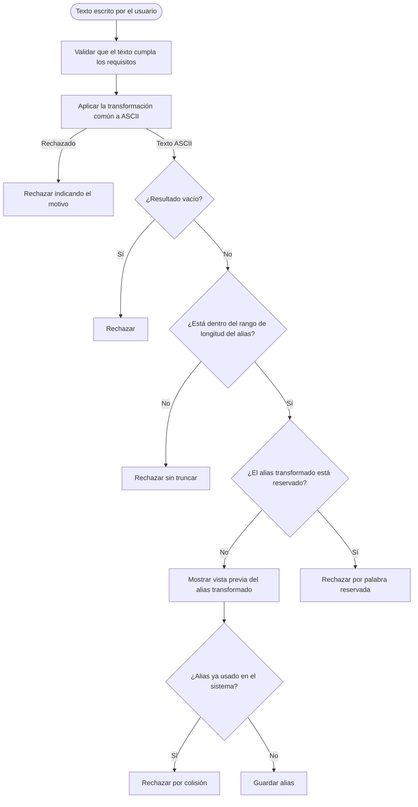

# Proceso de generación del alias

Diagrama derivado de [specifications.md → «Generación del alias»](../specifications.md#generación-del-alias). La transformación se detalla en [Transformación común a ASCII](process-ascii-transformation.md).

