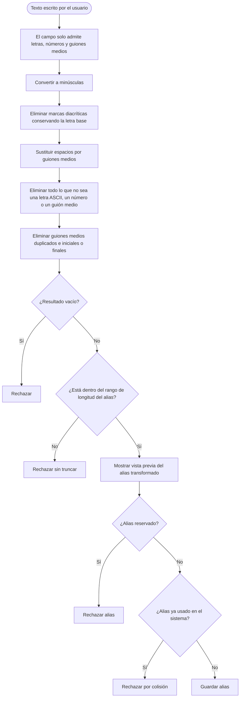

# Proceso de generación del alias

Diagrama derivado de [specifications.md → «Generación del alias»](../specifications.md#generación-del-alias).

El alias se transforma antes de mostrar la vista previa y se valida antes de guardarlo. No hay tablas de conversión: lo que no es una letra ASCII, un número o un guión medio se elimina. La lista de valores reservados, el rango y la regla de colisión tienen como fuente de verdad [specifications.md](../specifications.md).