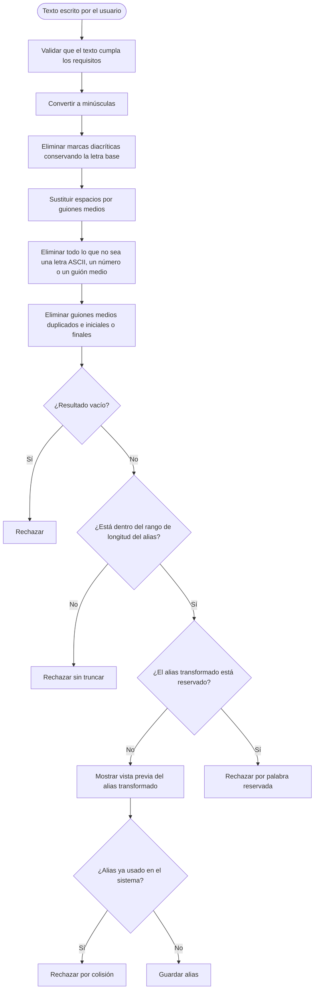

# Proceso de generación del alias

Diagrama derivado de [specifications.md → «Generación del alias»](../specifications.md#generación-del-alias).

```mermaid
flowchart TD
    start([Texto escrito por el usuario])
    input[Validar que el texto cumpla los requisitos]
    lowercase[Convertir a minúsculas]
    diacritics[Eliminar marcas diacríticas conservando la letra base]
    spaces[Sustituir espacios por guiones medios]
    allowed[Eliminar todo lo que no sea una letra ASCII, un número o un guión medio]
    hyphens[Eliminar guiones medios duplicados e iniciales o finales]
    empty{¿Resultado vacío?}
    rejectEmpty[Rechazar]
    range{¿Está dentro del rango de longitud del alias?}
    rejectRange[Rechazar sin truncar]
    preview[Mostrar vista previa del alias transformado]
    reserved{¿El alias transformado está reservado?}
    rejectReserved[Rechazar por palabra reservada]
    collision{¿Alias ya usado en el sistema?}
    rejectCollision[Rechazar por colisión]
    saveAlias[Guardar alias]

    start --> input --> lowercase --> diacritics --> spaces --> allowed --> hyphens --> empty
    empty -->|Sí| rejectEmpty
    empty -->|No| range
    range -->|No| rejectRange
    range -->|Sí| reserved
    reserved -->|Sí| rejectReserved
    reserved -->|No| preview --> collision
    collision -->|Sí| rejectCollision
    collision -->|No| saveAlias
```
