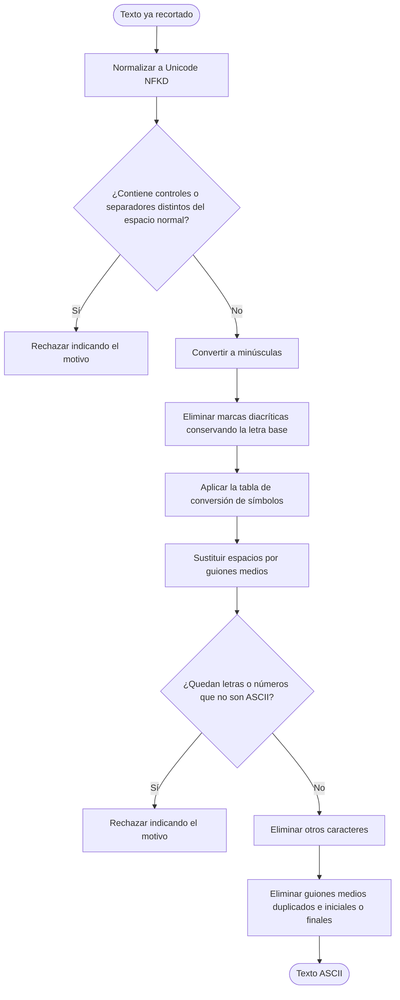

# Proceso de transformación común a ASCII

Diagrama derivado de [specifications.md → «Transformación común a ASCII»](../specifications.md#transformación-común-a-ascii). Lo usan la generación del alias y la generación de slugs.

