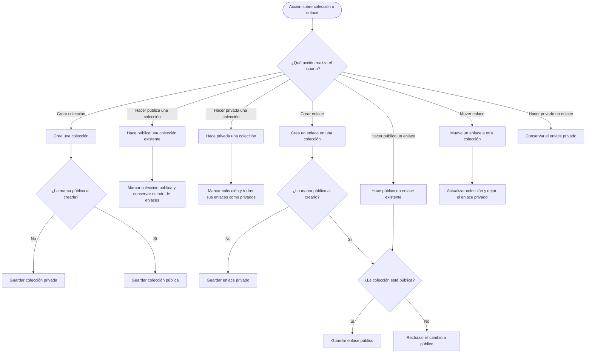

# Proceso de transiciones público y privado

Diagrama derivado de las invariantes de [domain-model.md → «Público y privado»](../domain-model.md#público-y-privado) y su garantía transaccional descrita en [architecture.md → «Persistencia»](../architecture.md#persistencia).

Las escrituras que deben cambiar varios elementos se aplican de forma atómica. Hacer pública una colección no publica sus enlaces; hacerla privada vuelve privados todos sus enlaces. Mover un enlace siempre lo deja privado, aunque la colección de destino sea pública.