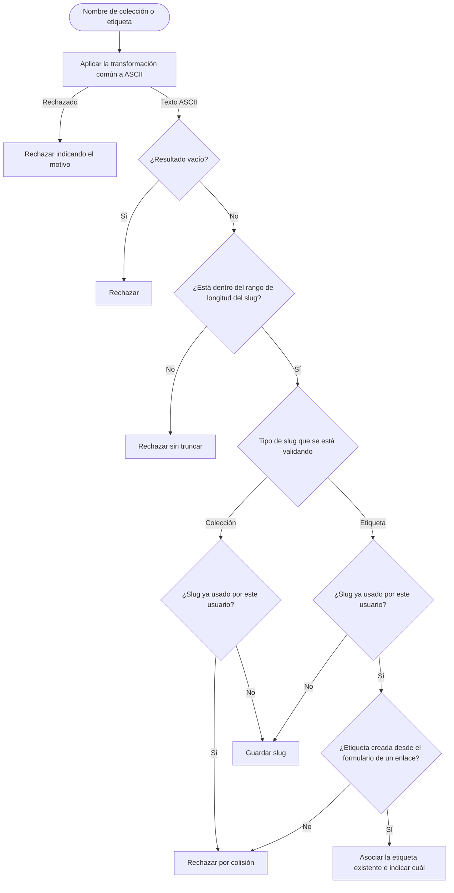

# Proceso de generación de slugs

Diagrama derivado de [specifications.md → «Generación de slugs»](../specifications.md#generación-de-slugs). La transformación se detalla en [Transformación común a ASCII](process-ascii-transformation.md).

