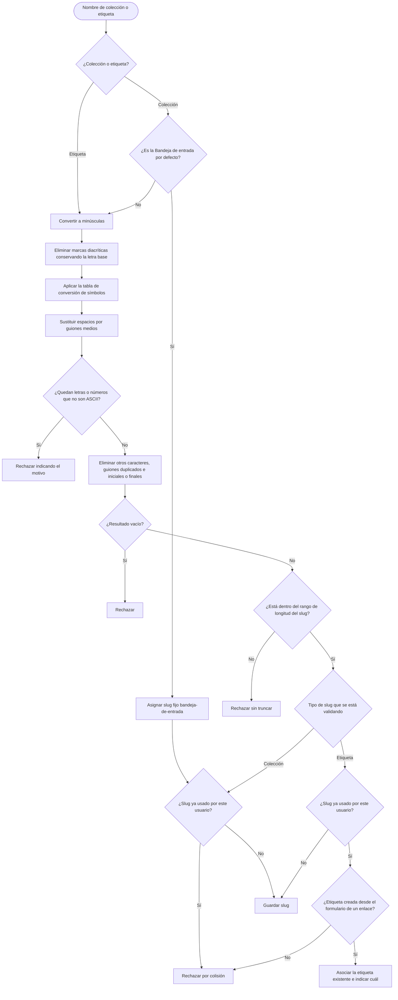

# Proceso de generación de slugs

Diagrama derivado de [specifications.md → «Generación de slugs»](../specifications.md#generación-de-slugs).

El proceso se aplica a las colecciones en el MVP0 y a las etiquetas desde el MVP1.

Los slugs se generan a partir del nombre y no se muestran al usuario. Un nombre con letras o números que no son ASCII y que la tabla no convierte se rechaza en lugar de recortarse. La coincidencia de nombre dentro de un usuario se resuelve mediante la unicidad del slug generado. La tabla de conversión, el rango y las reglas de colisión tienen como fuente de verdad [specifications.md](../specifications.md).
