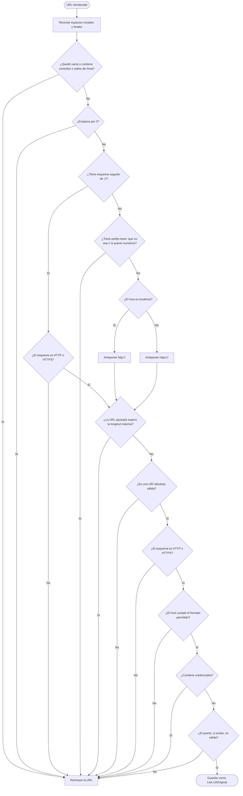

# Proceso de ajuste y validación de URL

Diagrama derivado de [specifications.md → «Ajuste y validación»](../specifications.md#ajuste-y-validación). El flujo corresponde a `Link.UrlOriginal`.

El formato de host permitido, la longitud máxima y las diferencias de `Image` (esquema, hosts y URL relativas al protocolo) están en [specifications.md → «Ajuste y validación»](../specifications.md#ajuste-y-validación) y [«Reglas adicionales para `Image`»](../specifications.md#reglas-adicionales-para-image), junto con sus ejemplos.
