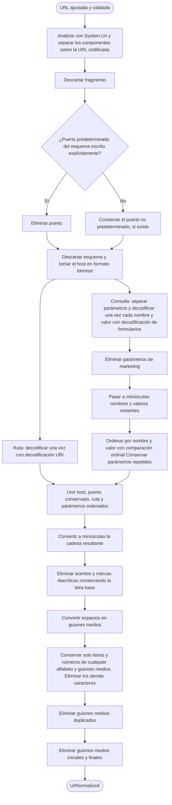

# Normalización de URL para detectar duplicados

Diagrama del proceso de `Link.UrlNormalized`, definido en [specifications.md → «Normalización para duplicados»](../specifications.md#normalización-para-duplicados).

