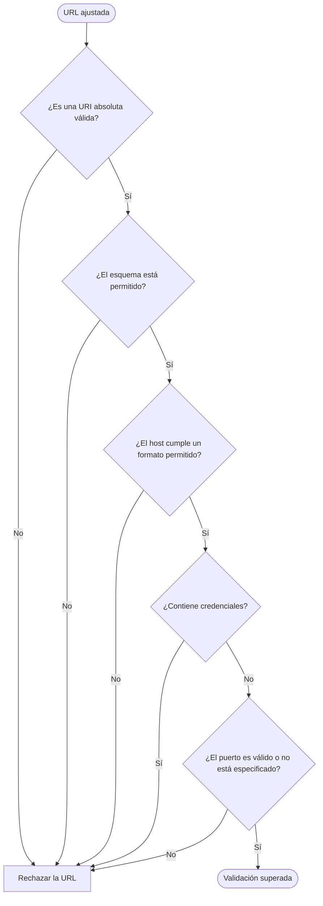

# Proceso de validación de URL

Diagrama derivado de [specifications.md → «Validación»](../specifications.md#validación). Se aplica al resultado del ajuste de URL o de `Image`; los criterios exactos están en esa sección.

