# Diagrama de casos de uso

Vista derivada de los requisitos y de los casos de uso iniciales de [architecture.md](../architecture.md). Los nodos externos son actores; los óvalos dentro del límite de Linkubator son casos de uso.

```mermaid
flowchart LR
    anonymous["Persona sin sesión"]
    registered["Usuario autenticado (MVP1)"]
    devIdentity["Identidad de desarrollo inyectada (MVP0)"]
    visitor["Visitante anónimo"]

    subgraph system["Sistema: Linkubator"]
        subgraph account["Cuenta (MVP1)"]
            register((Registrarse))
            complete((Completar registro))
            login((Iniciar sesión))
            logout((Cerrar sesión))
            recoverRequest((Solicitar recuperación de contraseña))
            recoverComplete((Restablecer contraseña))
            profile((Editar nombre y alias))
            changePassword((Cambiar contraseña))
            changeEmail((Cambiar email))
            deleteAccount((Eliminar cuenta))
        end

        subgraph manage["Gestión privada (MVP0)"]
            collections((Gestionar colecciones<br/>crear, editar, hacer públicas o privadas y eliminar))
            links((Gestionar enlaces<br/>crear, editar, hacer públicos o privados, mover y eliminar))
            search((Buscar y filtrar enlaces por colección))
            collectionSearch((Buscar colecciones por nombre))
            lists((Consultar colecciones propias))
        end

        subgraph tagManagement["Gestión de etiquetas (MVP1)"]
            tags((Gestionar etiquetas<br/>crear, editar y eliminar))
            linkTags((Asociar y desasociar etiquetas<br/>incluida la creación desde un enlace))
            tagSearch((Buscar enlaces por nombre de etiqueta y filtrar por etiqueta))
            tagNameSearch((Buscar etiquetas por nombre))
            tagLists((Consultar etiquetas propias))
        end

        subgraph public["Consulta pública"]
            landing((Consultar landing))
            userPage((Consultar página pública de usuario))
            collectionList((Consultar página pública de colecciones))
            collectionPage((Consultar página de colección pública))
        end
    end

    anonymous --> register
    anonymous --> complete
    anonymous --> login
    anonymous --> recoverRequest
    anonymous --> recoverComplete

    registered --> logout
    registered --> profile
    registered --> changePassword
    registered --> changeEmail
    registered --> deleteAccount
    registered --> collections
    registered --> tags
    registered --> links
    registered --> linkTags
    registered --> search
    registered --> collectionSearch
    registered --> lists
    registered --> tagSearch
    registered --> tagNameSearch
    registered --> tagLists

    devIdentity --> collections
    devIdentity --> links
    devIdentity --> search
    devIdentity --> collectionSearch
    devIdentity --> lists

    visitor --> landing
    visitor --> userPage
    visitor --> collectionList
    visitor --> collectionPage

    classDef future fill:#fff,stroke:#777,stroke-dasharray:5 5,color:#555
```

En el MVP0, la identidad de desarrollo inyectada permite la gestión privada, pero no ofrece casos de uso de cuenta ni una sesión real. En el MVP1, el usuario autenticado también puede actuar como visitante en las páginas públicas.