# Diagrama de casos de uso

Vista general de las capacidades del producto, derivada de [requirements.md](../requirements.md). La organización técnica está en [architecture.md → «Casos de uso iniciales»](../architecture.md#casos-de-uso-iniciales). No representa una etapa de entrega concreta. Los nodos externos son actores; los óvalos dentro del límite de Linkubator son casos de uso.

```mermaid
flowchart LR
    anonymous["Persona sin sesión"]
    registered["Usuario autenticado"]
    visitor["Visitante anónimo"]

    subgraph system["Sistema: Linkubator"]
        subgraph account["Cuenta"]
            register((Registrarse))
            complete((Completar registro))
            login((Iniciar sesión))
            logout((Cerrar sesión))
            recoverRequest((Solicitar recuperación de contraseña))
            recoverComplete((Restablecer contraseña))
            profile((Editar nombre y alias))
            changePassword((Cambiar contraseña))
            changeEmail((Cambiar email))
            deleteAccount((Eliminar cuenta))
        end

        subgraph manage["Gestión privada"]
            collections((Gestionar colecciones<br/>crear, editar, hacer públicas o privadas y eliminar))
            tags((Gestionar etiquetas<br/>crear, editar y eliminar))
            links((Gestionar enlaces<br/>crear, editar, hacer públicos o privados, mover y eliminar))
            scraping((Solicitar scraping de metadatos))
            search((Buscar y filtrar enlaces por colección y etiqueta))
            collectionSearch((Buscar colecciones por nombre))
            tagSearch((Buscar etiquetas por nombre))
            lists((Consultar colecciones y etiquetas propias))
        end

        subgraph public["Consulta pública"]
            landing((Consultar landing))
            userPage((Consultar página pública de usuario))
            collectionList((Consultar página pública de colecciones))
            collectionPage((Consultar página de colección pública))
        end
    end

    anonymous --> register
    anonymous --> complete
    anonymous --> login
    anonymous --> recoverRequest
    anonymous --> recoverComplete

    registered --> logout
    registered --> profile
    registered --> changePassword
    registered --> changeEmail
    registered --> deleteAccount
    registered --> collections
    registered --> tags
    registered --> links
    registered --> scraping
    registered --> search
    registered --> collectionSearch
    registered --> tagSearch
    registered --> lists

    visitor --> landing
    visitor --> userPage
    visitor --> collectionList
    visitor --> collectionPage

    classDef future fill:#fff,stroke:#777,stroke-dasharray:5 5,color:#555
```

